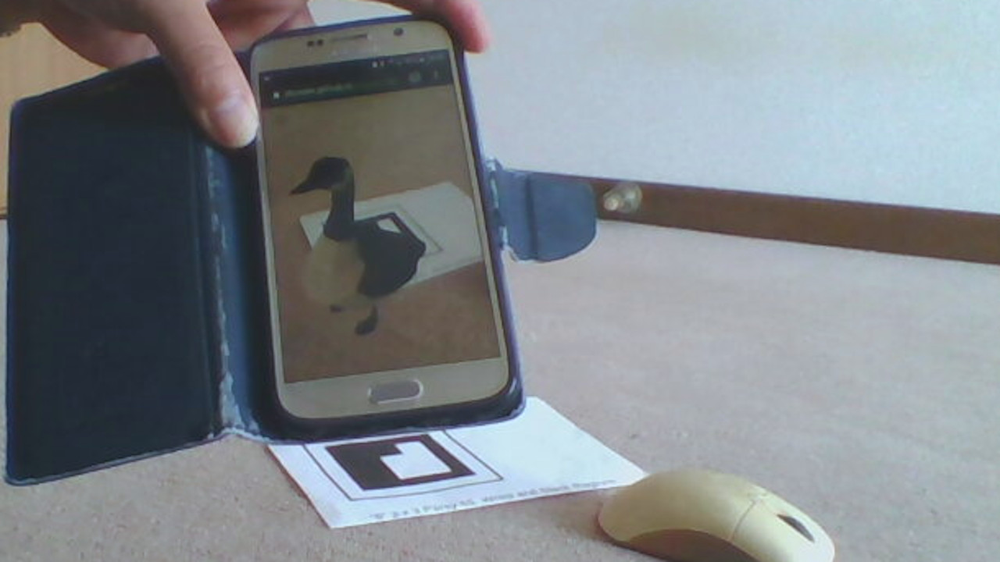

# AugRe
Augmented Reality (AR) viewer. Display .GLB 3D models in cross-browser AR using marker-based AR.js.

What makes this project *unique* is the ability to **easily load different models/files**.

Other pros:
* Works on older phones.
* Does not need ARCore.
* Works in browser. No app installation.

* * *
## Run the Demo
In short:
1. Download a 3D model onto your device.
1. Print out a barcode marker.
1. Point your device camera at the marker.
1. Open a [web page](https://dtcwee.github.com/augre/marker.html).

Watch demo:

<a href="https://youtu.be/nNwno9vzTm4"></a>

### Get 3D models
1. Get some 3D models. Try [poly.gogle.com](https://poly.gogle.com).
2. Your models need to be in single-file .GLB format. You can [convert .gltf to .GLB files here](https://sbtron.github.io/makeglb/).
3. Finally, transfer the .GLB files to your smart device's storage (local or cloud).

### Print Marker
Print these markers:


and


Notes:
* The AR engine will recognise markers displayed on screen, but it is much easier to work with printed out markers.
* While the code is currently set to look for an '8' encoded as a black marker with white region/border, it will also recognise a white marker with black region/border.

### Open Demo Web Page
Point your device camera at the marker and open [this web page](https//dtcwee.github.com/augre/marker.html). Allow it to use your camera, if prompted. 

The default '?' model will appear over the marker. Open the hamburger menu to load your file from local storage. You can also load files on **cloud storage (e.g. Google Drive)** provided your file explorer can browse it. 

* * *
## Install/Deploy
To get your own version to modify or play with, clone or download a zip of the repository.

Place the files where they can be served by your web server. Or, open them in an IDE and serve with a web server extension. Recommended: Visual Studio Code with the Live Server extension.

Your web server only needs to serve static HTML. There is no server-side processing. 

### Test
This project will run on a development PC with a webcam, e.g. a laptop.

However, testing multi-touch gestures is difficult unless your machine and browser supports touch input. Recommended: 2-finger pinch works in Chrome/Chromium (developer mode) on touch-screen laptops.

Serving to another device requires your web server run SSL (https:), usually an additional configuration step. AR uses motion tracking which [no longer works over insecure HTTP](https://www.chromestatus.com/feature/5688035094036480).
* * *
### Modify
Miscellaneous modification tips.
#### Change Marker

The markers were made with this [marker generator](https://au.gmented.com/app/marker/marker.php). If you want to use a different marker, you can use it to create one. Markers with error checking (e.g. Parity 6,5) seem easier to detect.

Edit the HTML in 2 places to correspond to the marker you generated:

```
arjs='sourceType: webcam; debugUIEnabled: false; detectionMode: mono_and_matrix; matrixCodeType: 3x3_PARITY65; labelingMode: white_region'
```
and

```
a-marker type="barcode" value="8"
```
More details in the [Marker-based AR.js documentation](https://ar-js-org.github.io/AR.js-Docs/marker-based/#a-frame).

#### Error-handling and reset
You might want to put in some error handling. Particularly if files can't load.

I also add a function to reset the model to the default '?'. I figured you could just refresh the page.

#### Alternate file formats
.GLB (gltf) has native support in A-Frame, and thus AR.js. There are extensions to support other formats, but there are also many format converters. More details at the [A-Frame gltf-model page](https://aframe.io/docs/1.0.0/components/gltf-model.html).
 * * *

## Built With
* [jQuery](https://jquery.com/) - Javascript library, CDN-linked 
* [jQueryUI](https://jqueryui.com) - UI library, CDN-linked 
* [fatNav](https://github.com/Glitchbone/jquery-fatNav) - Menu, locally cloned
* [AR.js](https://ar-js-org.github.io/AR.js-Docs/) - Augmented Reality library, CDN-linked 


## License

This project is licensed under the MIT License - see the [LICENSE.md](LICENSE.md) file for details

## References

* [HTML5 JQuery File Load](https://scotch.io/tutorials/use-the-html5-file-api-to-work-with-files-locally-in-the-browser)
* [Manipulate 3D content](https://medium.com/@fabiojcortes/manipulate-your-3d-content-with-gestures-in-ar-js-78da4c076607)
* [Deliver AR with QR Code](https://medium.com/chialab-open-source/how-to-deliver-ar-on-the-web-only-with-a-qr-code-e24b7b61f8cb)
* [AR.js - Cross-browser Augmented Reality](https://medium.com/chialab-open-source/ar-js-the-simpliest-way-to-get-cross-browser-ar-on-the-web-8f670dd45462)