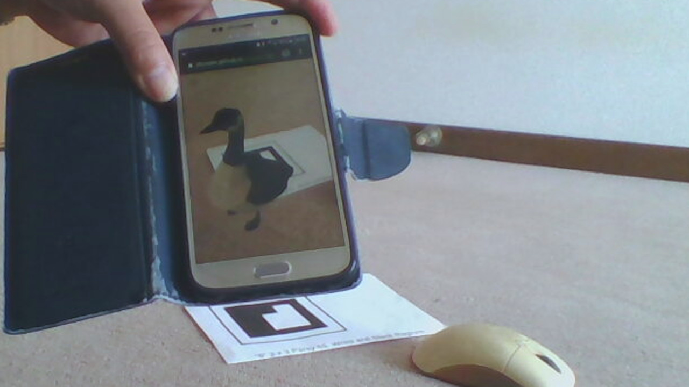

# AugRe

Augmented Reality (AR) web viewers for displaying .GLB 3D models in the real world.

## Methods

### 1. Model-Viewer (Recommended)
Uses [Model-Viewer](https://modelviewer.dev/), [WebXR](https://developer.mozilla.org/en-US/docs/Web/API/WebXR_Device_API), and [ARCore](https://developers.google.com/ar/).
* **Pros:** Best performance and native device AR integration.
* **Requirements:** Modern mobile device with ARCore support.

### 2. AR.js (Compatibility)
Uses [AR.js](https://ar-js-org.github.io/AR.js-Docs/).
* **Pros:** Works on older phones and desktop browsers.
* **Requirements:** Does not require ARCore. Uses marker-based tracking.

---

## Common Setup: Getting 3D Models
Both methods require .GLB files:
1. **Source:** Download 3D models from sites like [Sketchfab](https://sketchfab.com/).
2. **Format:** Models must be in single-file **.GLB** format. If you have a different format, use a [converter](https://sbtron.github.io/makeglb/).
3. **Storage:** Save files to your device or accessible cloud storage (e.g., Google Drive).

---

## Running the Demos
### Model-Viewer (WebXR)
1. **Access:** Open the [model-viewer page](https://dtcwee.github.io/augre/modelviewer.html).
2. **View:** Use the on-screen controls to view the model or project it into your space using WebXR.

### AR.js (Marker-based)
  1. **Print:** Print the provided markers ([marker1](img/8-3x3parity65b.png) or [marker2](img/8-3x3parity65w.png)).
2. **Access:** Open the [marker-based page](https://dtcwee.github.io/augre/marker.html).
3. **View:** Point your camera at the printed marker to trigger the 3D model.
---

## Deployment & Development

### Local Development
* **Server:** This project is static (no server-side processing). Use the "Live Server" extension in VS Code for easy testing.
* **SSL/HTTPS:** Web-based AR (especially motion tracking) requires HTTPS. If testing on a mobile device from a PC, you must configure your local server for SSL.

### Modifying AR.js Markers
To change the marker for the AR.js version, use a [marker generator](https://au.gmented.com/app/marker/marker.php) and update the `arjs` attribute and `a-marker` value in your HTML.

---

## Built With
* [jQuery](https://jquery.com/) & [jQueryUI](https://jqueryui.com)
* [AR.js](https://ar-js-org.github.io/AR.js-Docs/)
* [Model-Viewer](https://modelviewer.dev/)
* [fatNav](https://github.com/Glitchbone/jquery-fatNav)

## License
Licensed under the [MIT License](LICENSE.md).
